# Active Directory Attack & Defense Lab

A four-VM Active Directory lab where I run a full attack chain, from one phished user account to full domain compromise, then catch each step with Windows event logs and a custom Wazuh rule.

**Techniques:** Kerberoasting, Pass-the-Hash, DCSync
**Stack:** Windows Server 2022, Windows 11, Kali Linux, Wazuh SIEM, Sysmon
**Mapped to:** MITRE ATT&CK (T1558.003, T1550.002, T1003.006)

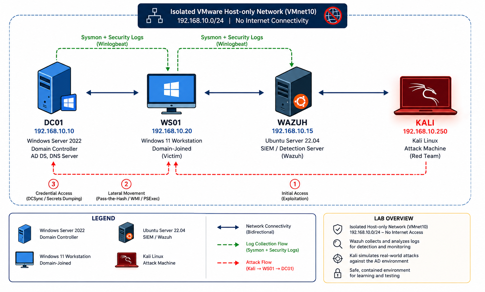

I built the whole thing in VMware, ran every attack by hand from Kali, and confirmed each one showed up somewhere I could detect it. The part I'm proudest of is the DCSync detection, since Wazuh doesn't catch that out of the box and I had to write the rule myself.

---

## Lab Architecture

| Host | Role | OS | IP |
|------|------|-----|-----|
| **DC01** | Domain Controller (`LABBOX.local`) | Windows Server 2022 | `192.168.1.10` |
| **WS01** | Domain-joined workstation | Windows 11 | `192.168.1.20` |
| **Kali** | Attacker | Kali Linux | `192.168.1.250` |
| **Wazuh** | SIEM / log analysis | Ubuntu Server | `192.168.1.15` |

Everything sits on an isolated host-only `192.168.1.0/24` network so the attack traffic stays contained.

---

## The Attack Chain

```
j.rivera (phished employee, low privilege)
   └─▶ Recon with BloodHound
        └─▶ Kerberoast svc-sql → crack weak password offline
             └─▶ Pass-the-Hash into WS01 as SYSTEM
                  └─▶ DCSync → dump every credential in the domain
```

---

### 1 · Recon with BloodHound

From the `j.rivera` account, I pulled the domain graph and loaded it into BloodHound CE to hunt for a path to Domain Admin.

```bash
bloodhound-python -u j.rivera -p 'Summer2025!' -d labbox.local -ns 192.168.1.10 -c All --zip
```

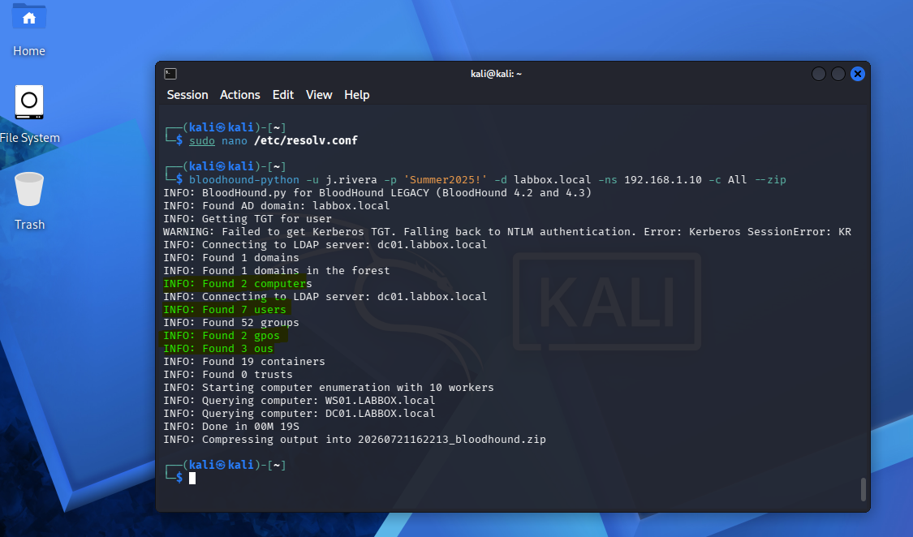

The shortest-path query from `j.rivera` to Domain Admins came back empty, which is actually the right answer. BloodHound maps permission edges like group membership or GenericAll, and `j.rivera` has none of those. It only matters because it's a valid domain user, which is all Kerberoasting needs. The real escalation is an offline password crack, and that never shows up as a graph edge.

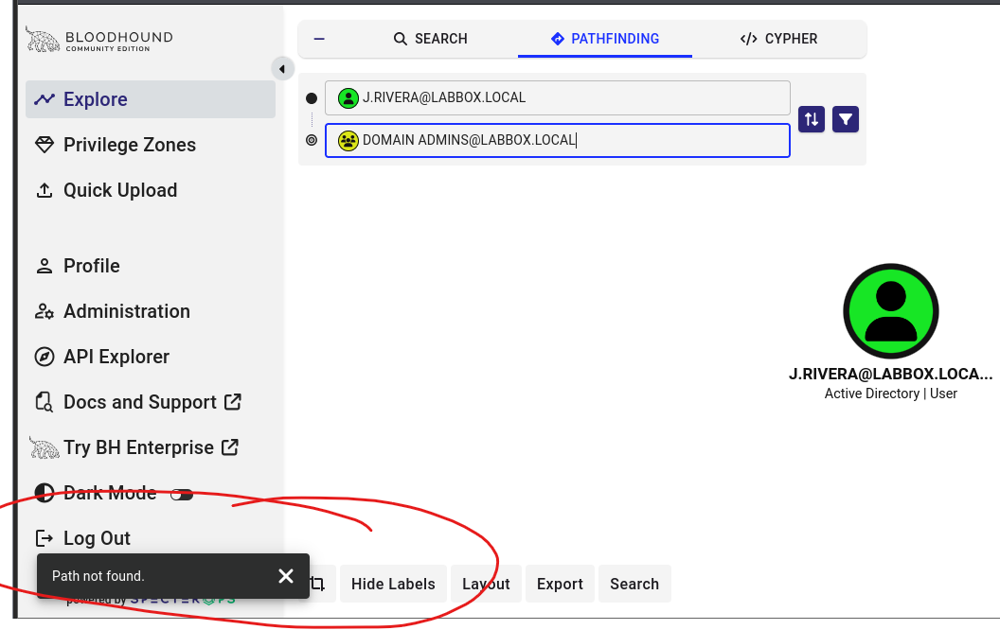

Once `svc-sql` is compromised the picture changes. A fresh scan draws a real path from `svc-sql` to Domain Admins, through a GenericWrite on DC01 and a CoerceToTGT edge into the domain.

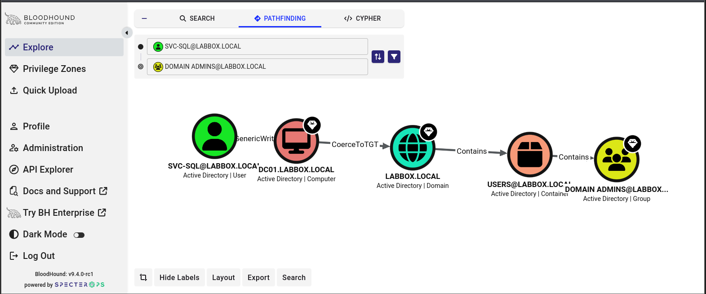

---

### 2 · Kerberoasting (T1558.003)

Any domain user can request a service ticket for an account with an SPN, and that ticket is encrypted with the account's password hash. So I grabbed `svc-sql`'s and cracked it offline.

```bash
impacket-GetUserSPNs labbox.local/j.rivera:'Summer2025!' \
  -dc-ip 192.168.1.10 -request -outputfile kerberoast.hash
```

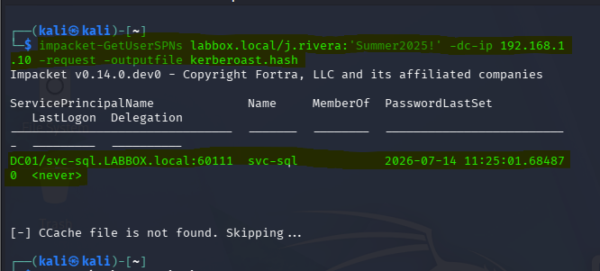
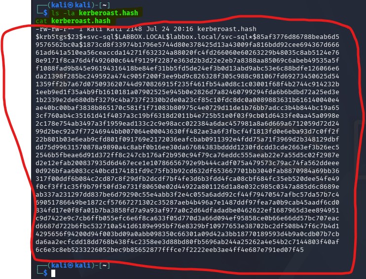

It fell in under a second against `rockyou.txt`. The password was `Welcome1`.

```bash
john --wordlist=/usr/share/wordlists/rockyou.txt kerberoast.hash
```

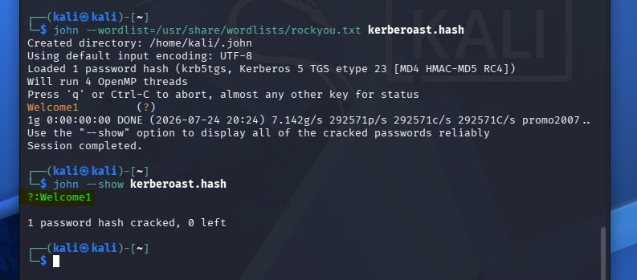

---

### 3 · Pass-the-Hash (T1550.002)

`svc-sql` had local admin on WS01, which happens all the time in real networks. So I logged in with its NT hash and never typed a password.

```bash
impacket-psexec -hashes :<NT_HASH> LABBOX/svc-sql@192.168.1.20
```

That dropped a SYSTEM shell on WS01. Defender and Tamper Protection actually blocked the payload on my first few tries, which was a nice reminder that built-in AV catches this, so I had to work around it.

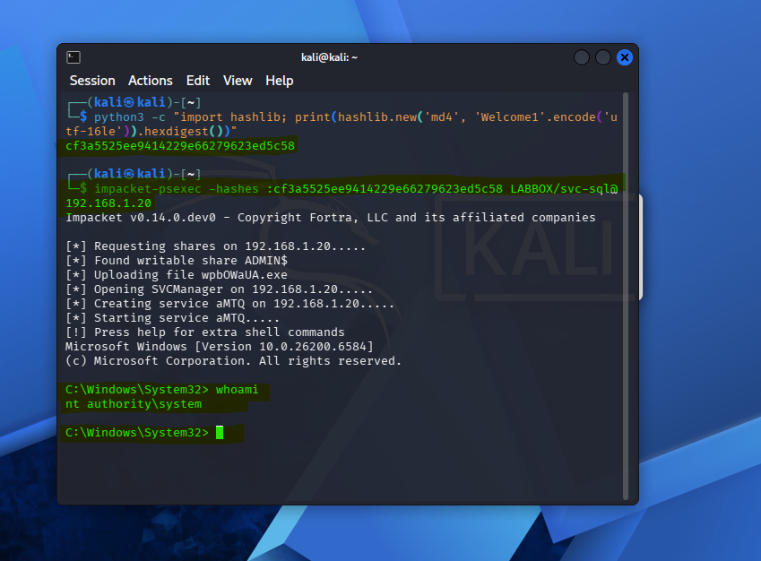

---

### 4 · DCSync (T1003.006)

`svc-sql` had been given Replicating Directory Changes rights, which is exactly what an over-delegated service account looks like in the wild. That let me impersonate a domain controller and replicate every hash out of the domain, including `krbtgt`.

```bash
impacket-secretsdump -hashes :<NT_HASH> LABBOX/svc-sql@192.168.1.10
```

Full domain compromise. Every user, service, and machine account hash, dumped.

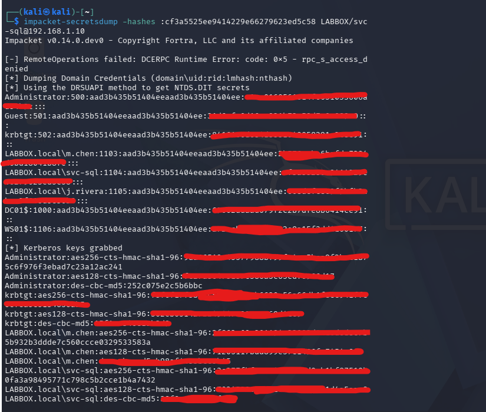
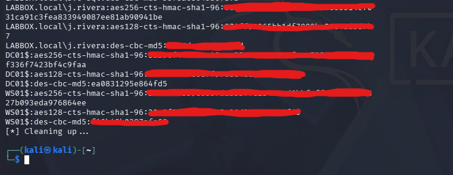

---

## Detection & Defense

Running the attacks is only half the job. I went back and confirmed each one left a trail in Windows telemetry and in Wazuh.

### Native Windows event signatures

| Attack | Event ID | What gives it away |
|--------|----------|--------------------|
| Kerberoasting | **4769** | Ticket encryption type `0x17` (RC4) on a service account |
| Pass-the-Hash | **4624** | Logon Type 3 with NTLM as the auth package |
| DCSync | **4662** | Object access using a replication-rights GUID `{1131f6aa-...}` |

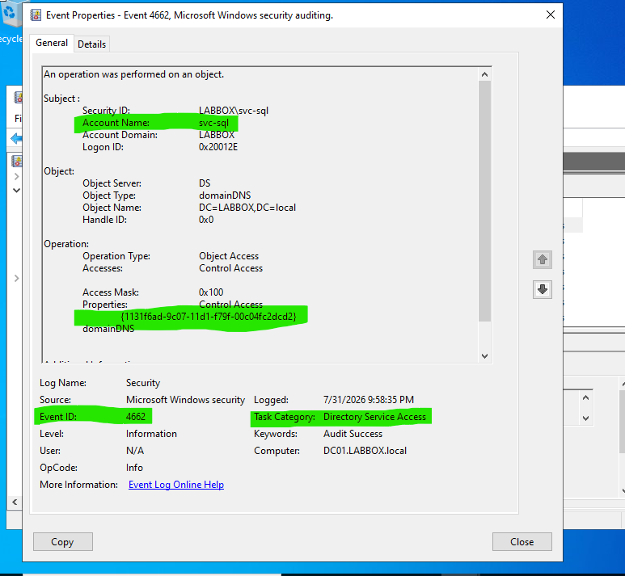

### Custom Wazuh detection rules

Nobody watches Event Viewer all day, so I turned those signatures into three Wazuh rules in `/var/ossec/etc/rules/local_rules.xml`, one per attack, each mapped to its MITRE technique.

**Kerberoasting.** A 4769 by itself is normal. The tell is the encryption type. Modern Kerberos uses AES, so an RC4 request (`0x17`) for a service account is worth flagging.

<details>
<summary>Rule 100200 — Kerberoasting (T1558.003)</summary>

```xml
<group name="active_directory,kerberoasting,">
  <rule id="100200" level="12">
    <if_group>windows_security</if_group>
    <field name="win.system.eventID">^4769$</field>
    <field name="win.eventdata.ticketEncryptionType">^0x17$</field>
    <description>Possible Kerberoasting: RC4-encrypted service ticket requested (MITRE T1558.003)</description>
    <mitre>
      <id>T1558.003</id>
    </mitre>
  </rule>
</group>
```

</details>

**Pass-the-Hash.** NTLM network logons happen legitimately, so this one is tuned lower and worded as "review." In production I'd scope it to admin accounts or specific subnets, otherwise the false positives would bury you.

<details>
<summary>Rule 100220 — Pass-the-Hash (T1550.002)</summary>

```xml
<group name="active_directory,pass_the_hash,">
  <rule id="100220" level="10">
    <if_group>windows_security</if_group>
    <field name="win.system.eventID">^4624$</field>
    <field name="win.eventdata.logonType">^3$</field>
    <field name="win.eventdata.authenticationPackageName">NTLM</field>
    <description>NTLM network logon - review for Pass-the-Hash (MITRE T1550.002)</description>
    <mitre>
      <id>T1550.002</id>
    </mitre>
  </rule>
</group>
```

</details>

**DCSync.** The one Wazuh misses by default, and my favorite. Event 4662 fires constantly during normal AD activity, so alerting on all of it would bury an analyst. The fix is to only fire when the 4662 carries one of the two replication-rights GUIDs DCSync abuses. That combination barely ever shows up outside a real replication, and when it comes from something that isn't a domain controller, it's a strong signal.

<details>
<summary>Rule 100010 — DCSync (T1003.006)</summary>

```xml
<group name="active_directory,dcsync,">
  <rule id="100010" level="12">
    <if_group>windows_security</if_group>
    <field name="win.system.eventID">^4662$</field>
    <field name="win.eventdata.properties">1131f6aa-9c07-11d1-f79f-00c04fc2dcd2|1131f6ad-9c07-11d1-f79f-00c04fc2dcd2</field>
    <description>Possible DCSync attack: AD replication rights used by $(win.eventdata.subjectUserName)</description>
    <mitre>
      <id>T1003.006</id>
    </mitre>
    <group>dcsync,mitre_credential_access,</group>
  </rule>
</group>
```

</details>

When I ran DCSync, the rule fired a burst of level-12 alerts inside a ~3-second window, matching how fast `secretsdump` hammers out its replication requests. It named `svc-sql` as the source and tagged the alert with T1003.006.

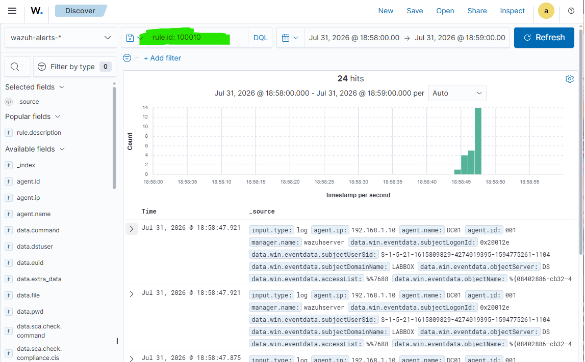
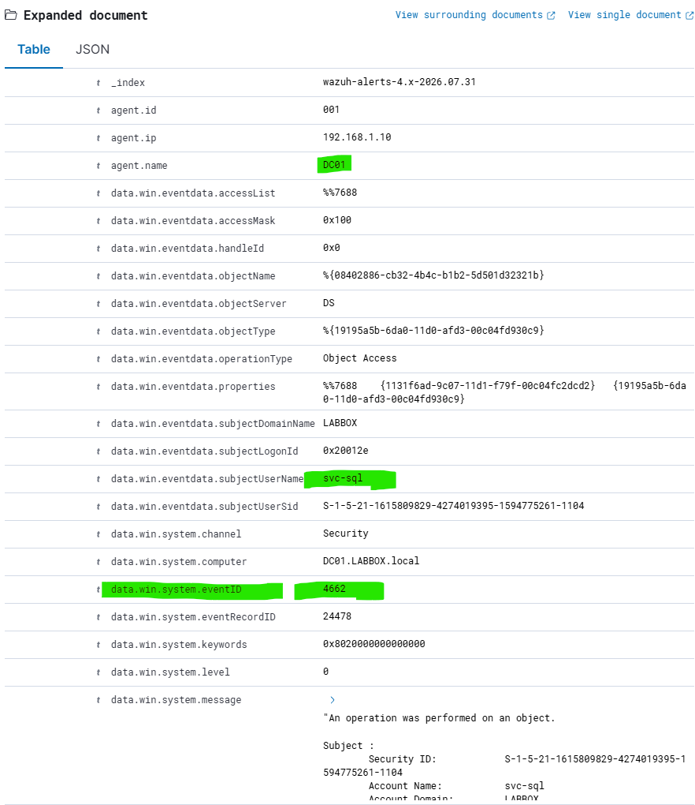
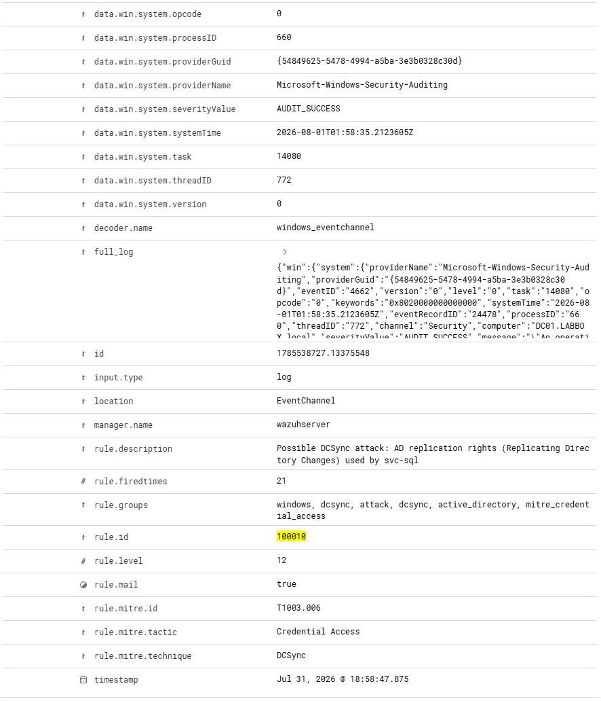

---

## Incident Response Summary

| Stage | Technique | MITRE ID | How you'd catch it |
|-------|-----------|----------|--------------------|
| Recon | LDAP/SAMR enumeration | T1087, T1069 | BloodHound collection traffic |
| Credential Access | Kerberoasting | T1558.003 | Event 4769 (RC4 ticket) |
| Credential Access | Offline cracking | T1110.002 | Not visible (offline) |
| Lateral Movement | Pass-the-Hash | T1550.002 | Event 4624 (NTLM, Type 3) |
| Credential Access | DCSync | T1003.006 | Event 4662 + Wazuh rule 100010 |

### What I'd fix in a real environment
- Strong, unique passwords on service accounts, or gMSAs with automatic rotation. That alone kills the Kerberoasting path.
- Audit delegation and pull back anything excessive. No service account should hold Replicating Directory Changes rights.
- Keep service accounts out of local admin groups on workstations so they can't be used to move laterally.
- Alert on the giveaways: RC4 service tickets, unexpected NTLM network logons, and replication requests from anything that isn't a domain controller.

---

## What I ran into

This took a lot of troubleshooting, not just typing commands. Kerberos threw clock-skew errors until I synced the attacker and DC clocks. WS01's domain trust broke and needed repairing. Defender's Tamper Protection kept quietly turning itself back on. And at one point my DCSync events weren't reaching Wazuh at all, because the manager had crashed mid-attack from a full disk. The best part was figuring out Wazuh doesn't catch DCSync by default, then writing the rule that does.

---

Built by [Jayden Johnson](https://github.com/Jayden-j) · Information Systems (Cybersecurity), Mercer County Community College
